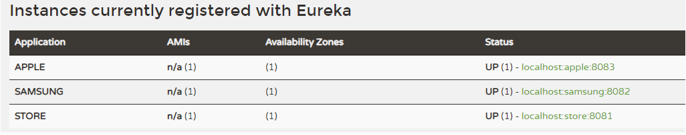
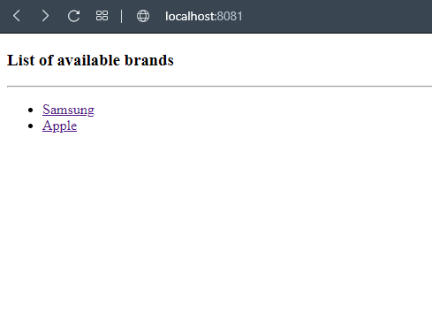
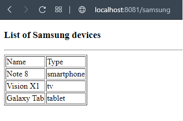
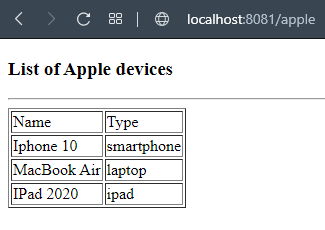

# REST Microservices
This is a simple REST microservices application to demonstrate how microservices work.
This project has only one commit, when I uploaded it to the repository, because I did not know GIT when I started programming this app.   
I used IntelliJ IDE to create this application.

## What is a microservice ?
A microservice is a modular software component designed to perform a single defined task.
Each microservice is created by a separate mini-application that has its own business logic
and ability to perform functions such as database access and messaging. 
The resulting application will consist of interconnected components 
that communicate with each other using appropriate communication protocols.
Microservices typically communicate with each other using application programming interfaces (APIs) [1].

## What is REST ?
REST is an extension of Representational State Transfer.  
REST is a set of practices that define how we should implement web services. REST is based on entities.  
Entities are accessed using appropriate HTTP query types.  
Query types are specified by HTTP verbs: GET, POST, PUT and DELETE.  
These verbs along with the URL define exactly what operation we want to perform on the given entity.  

The reason why REST based microservices examples are most popular is more than likely due to their simplicity. 
Services communicate directly and synchronously with each other over HTTP, without the need for any additional infrastructure [2].

For this project I also used Spring Eureka Server.
Eureka Server is an application that holds the information about all client-service applications.
Every Micro service will register into the Eureka server and Eureka server knows 
all the client applications running on each port and IP address.
Eureka Server is also known as Discovery Server [3].

## Used technologies
- Spring framework,
- Maven,
- JSTL,
- MySQL database.

## How it works ?
This is a simple application to show the records stored in the database in a browser. 
I created Apple and Samsung applications which are used to get data from database 
concerning name and type of the device of a given brand. 

First, you need to start Eureka Server application. 
Then run the Store application and then Apple and Samsung application.
It is important to set different port numbers on which each application start.

Eureka Server starts on port 8761. Go to address localhost:8761 in your browser. There you can see 
which applications are registered into the Eureka server.

Then go to address localhost:8081 in your browser. You will see the main page.

There are two links that take you to pages that present data for the relevant brand.
Each data are taken from database using separate application.

Samsung:

Apple:

# Author
Michal Wonia  
Poland

# Bibliography
1. https://www.techopedia.com/definition/32503/microservices
2. https://capgemini.github.io/architecture/is-rest-best-microservices/
3. https://www.tutorialspoint.com/spring_boot/spring_boot_eureka_server.htm
